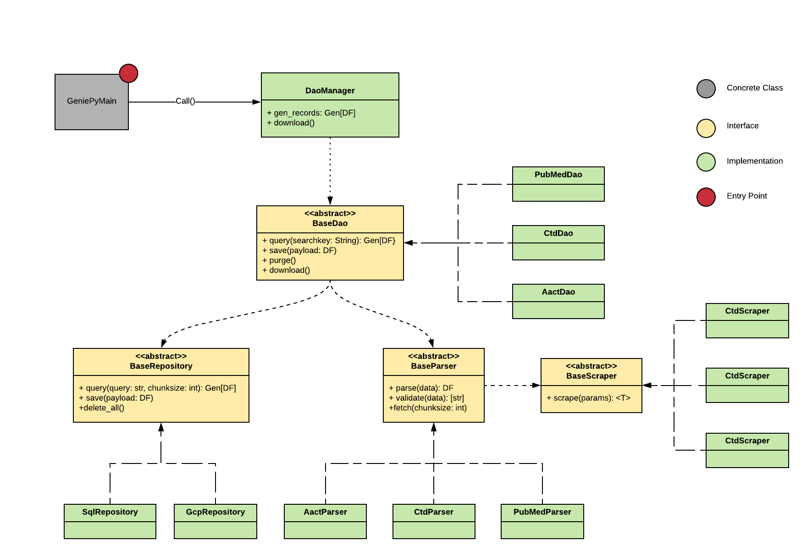
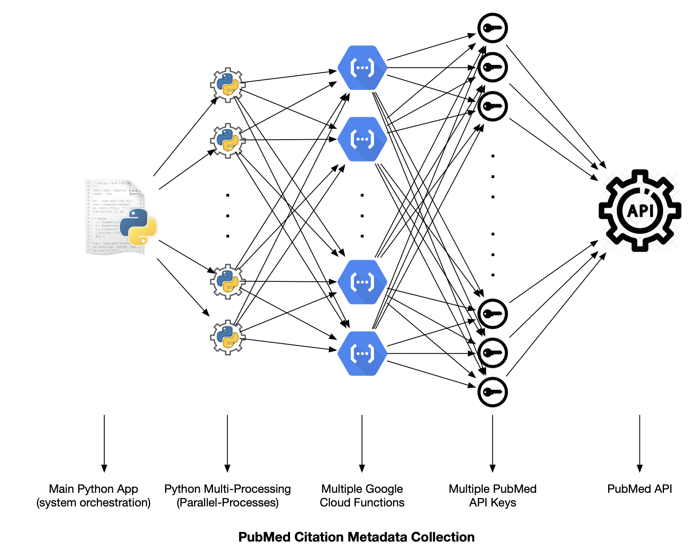

=======
GeniePy_
=======

GeniePy_ is a python package designed to predict gene/disease relationship trends. The application leverages machine learning to build two predictive classifiers:

**Publication Count Predictive Classifier**
    The Publication Count Predictive Classifier attempts to predict the order of magnitude of publications a given gene/disesase relationship will reach for a given time lag.

**Clinical Trials Predictive Classifier**
    The Clinical Trials Predictive Classifier attempts to predict whether or not a given gene/disease relationship will reach phase 2 clinical trial.

Application Architecture
------------------------
    The diagram below provides a high-level description of how the application is
    architected.

    The application is sub-divided into two main subpackages: Data and Classificaiton Management.

    - The data management subpackage is responsible for gathering and composing the data available online, create local databases, and serve this data as a pandas dataframe back to the main function.

    - The classification subpackage handles the classifiers and interacts with the main application by receiving a dataframe with classifier features and return a dataframe containing the corresponding predictions.

    The entry-point of the application starts by generating by scraping online sources and creating the necessary tables. The main application can then request the gathered data from the data management subpackage and feeds it into the classification manager to calculate the predictions. Once the predictions have been calculated, the resulting dataframes are handed back to the data management to store the predictions into the classification tables which are then queried by the user interface to display the results.

Data Management subpackage Class Diagram
----------------------------------------
    The diagram below depicts the class diagram for the Data Management subpackage.

Performance Optimization Using Cloud Functions
----------------------------------------------
    TODO: Describe use of cloud functions applied to increase performance and allow continuous querying to generate databases.

Contents
========

.. toctree::
   :maxdepth: 1

   License <license>
   Authors <authors>
   Changelog <changelog>
   Module Reference <api/modules>

Indices and tables
==================

* :ref:`genindex`
* :ref:`modindex`
* :ref:`search`

.. _GeniePy: https://pypi.org/project/geniepy/
